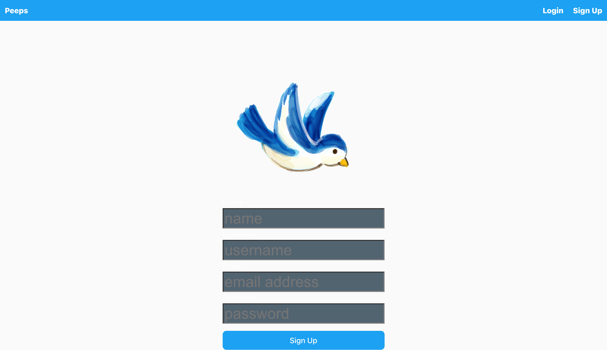
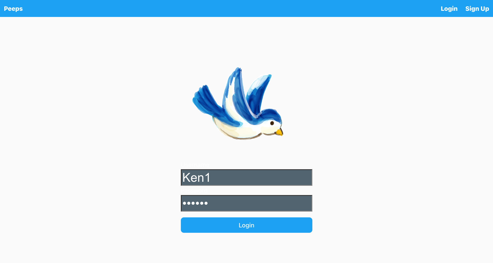
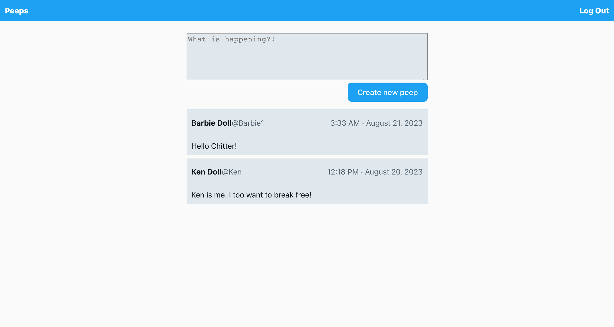
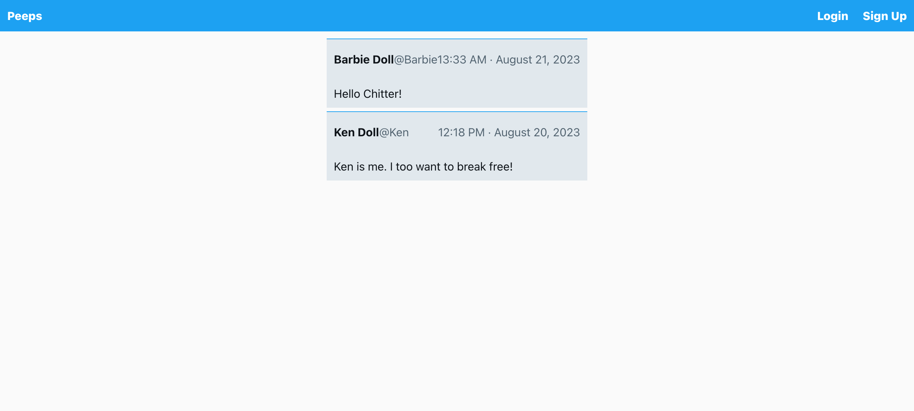

# Chitter Challenge

## Task:

Write a small twitter clone that will allow users to post messages to a public wall.

## User Stories

### Standard Acceptance Criteria

```
As a trainee software engineer
So that I can let people know what I am doing
I want to post a message (peep) to chitter

As a trainee
So that I can see what others are saying
I want to see all peeps in reverse chronological order

As a trainee
So that I can better appreciate the context of a peep
I want to see the time at which it was made

As a trainee
So that I can post messages on Chitter as me
I want to sign up for Chitter

As a trainee
So that only I can post messages on Chitter as me
I want to log in to Chitter

As a trainee
So that I can avoid others posting messages on Chitter as me
I want to log out of Chitter
```

## Additional requirements:

- You don't have to be logged in to see the peeps.
- Trainee software engineers sign up to chitter with their email, password, name and a username (e.g. ewright@digitalfutures.com, password123, Ed Wright, edwright6975).
- The username and email are unique.
- Peeps (posts to chitter) have the name of the trainee and their user handle.
- Your README should indicate the technologies used, and give instructions on how to install and run the tests.

### Extended Acceptance Criteria

```
As a trainee
So that I can stay constantly tapped in to the shouty box of Chitter
I want to receive an email if I am tagged in a Peep

As a trainee
In order to start a conversation as a DFA trainee Software Engineer
I want to reply to a peep from another trainee.
```

### Set up the project

1. Fork this repository and then:

```sh
$ git clone https://github.com/<YOUR GITHUB USERNAME>/chitter-challenge-df.git && cd chitter-challenge-df
```

2. Install Node.js dependencies for both FE and BE (API)

```
; cd api
; npm install
; cd ../frontend
; npm install
```

3. Install an ESLint plugin for your editor. For example: [`ESLint`](https://eslint.org/).

4. Install MongoDB

```
brew tap mongodb/brew
brew install mongodb-community@6.0
```

_Note:_ If you see a message that says `If you need to have mongodb-community@6.0 first in your PATH, run:`, follow the instruction. Restart your terminal after this. 5. Start MongoDB

```
brew services start mongodb-community@6.0
```

### Start

1. Start the server.

```
; cd api
; npm start
```

2. Start the front end

In a new terminal session...

```
; cd frontend
; npm run dev
```

You should now be able to open your browser and go to `http://localhost:5173/` to see a list of peeps, create a new user or login.

To sign up, go to http://localhost:5173/register.

Then, after signing up, you should be able to log in by going to `http://localhost:5173/login`.

After logging in, you won't see much but you can create a new peep and it will then show up in the browser when you click Create new peep.

3. Testing
   Front End Tests

```
; cd frontend
; npm run test
```

Back End (API) Tests

```
; cd api
; npm test
```

4. To see the test coverage report run:
   Front End Coverage

```
; cd frontend
; npm run coverage
```

Back End (API) Tests

```
; cd api
; npm test
```

4. To lint you project run:

```sh
; cd frontend
; npm run lint
```

5. To fix linting issues run;

```sh
; cd frontend
; npm run lint:fix
```

6. To format your code run;

```sh
$ npx prettier --write .
```

## Features

A user can:

- Sign up

- Sign in

- Create a new peep

- Sign out
- View a list of peeps


- ## Technologies

Here's an overview of the technologies used to build this template application.

### **M** is for MongoDB

[MongoDB](https://www.mongodb.com/) is a _NoSQL_ database program that stores data in collections of documents (in a format similar to JSON), rather than in tables. The application interacts with MongoDB using a tool called Mongoose.

### **E** is for Express

[Express](https://expressjs.com/)

### **R** is for React

[React](https://reactjs.org/) is a tool that is used to build engaging front ends. The basic principle is that the front end is split up into _components_, each of which _could_ include some logic, template structure (HTML) and styling (CSS).

### **N** is for Node

Java script was originally designed to run exclusively in browsers, such as Chrome. [Node](https://nodejs.org/en/) is a tool that allows you to run Javascript outside the browser and its invention made it possible to build full stack Javascript apps.

Other technologies used...

- [Vite](https://vitejs.dev/), a platform-agnostic frontend tool for building web applications quickly.
- [Mocha](https://mochajs.org/), [Chai](https://www.chaijs.com/) and [Sinon](https://sinonjs.org/) for unit testing on the back end.
- [Vitest](https://vitest.dev/) for component testing, on the front end.
- [Mongoose](https://mongoosejs.com) to model objects in MongoDB.
- [ESLint](https://eslint.org) for linting.
- [Prettier](https://prettier.io/) for formatting the code.
- [Express-Validator](https://express-validator.github.io/docs/) a set of express.js middlewares that wraps the extensive collection of validators and sanitizers offered by validator.js.
- [Nodemon](https://nodemon.io/) to reload the server automatically.
  
- ## Architecture

This application is comprised of two distinct pieces.

- A backend API built with Express
- A front end built with React

The React front end sends HTTP requests to the backend API and receives JSON in the response body, rather than a whole page of HTML.

## Authentication

Here's the authentication flow for this application:

1. A registered user submits their email address and username via the React front end.
2. The Express backend receives the data and tries to find a user in the DB with the same email address and username.
3. If a user is found, the password in the database is compared to the password that was submitted.
4. If the passwords match, a JSON Web Token is generated and returned, as part of the response.
5. The React front end receives the token and holds on to it.
6. Every request to `"/newPeep"` must include a valid token (which is checked by the backend).
7. When the user logs out, the front end discards the token.

### What is a JSON Web Token?

A JSON Web Token, or JWT, is a token that comprises three parts

- A header, which contains information about how the token was generated.
- A signature, which is used to verify the token.
- A payload, which you can use to store some non-sensitive data like a user id.

The signature is created using a 'secret', which must be kept private.
